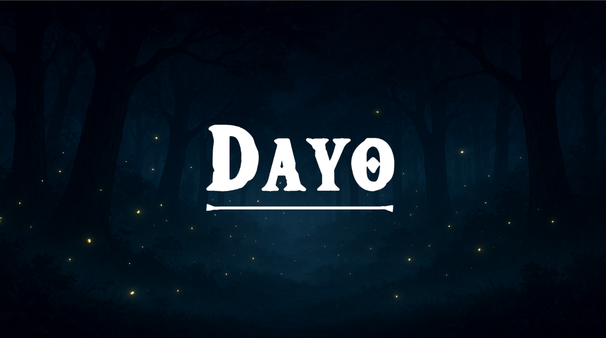
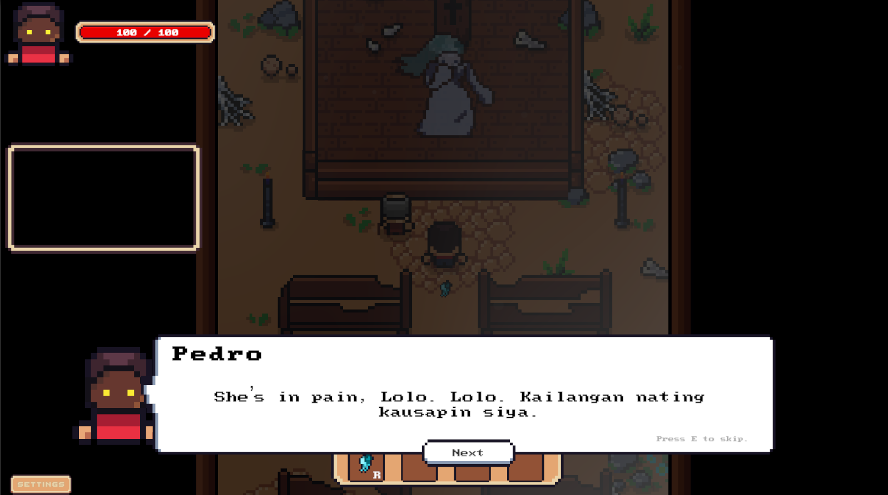
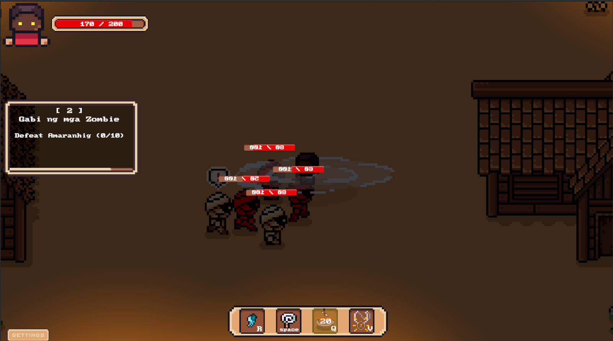
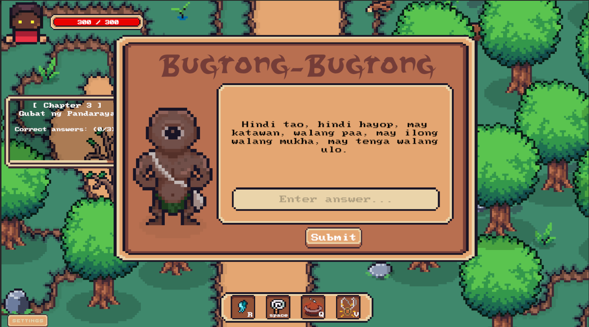
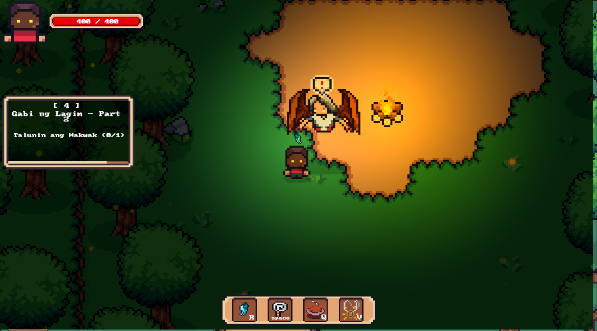
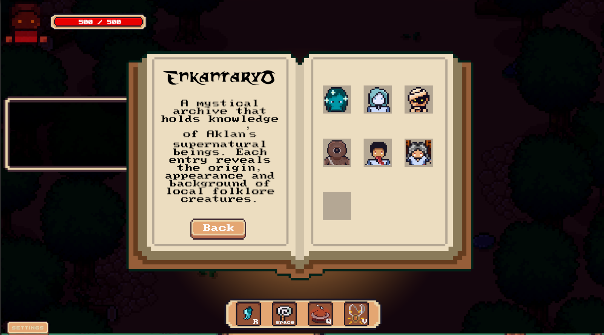
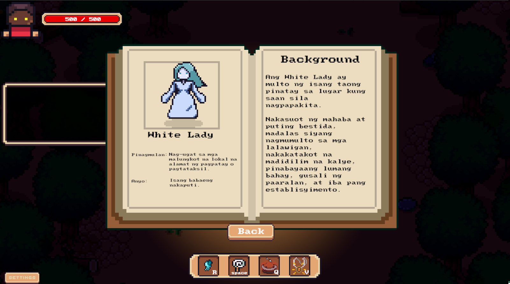
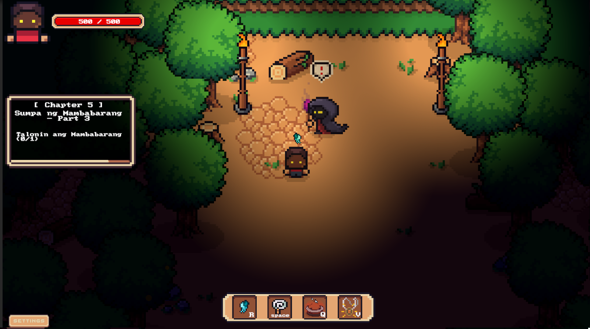
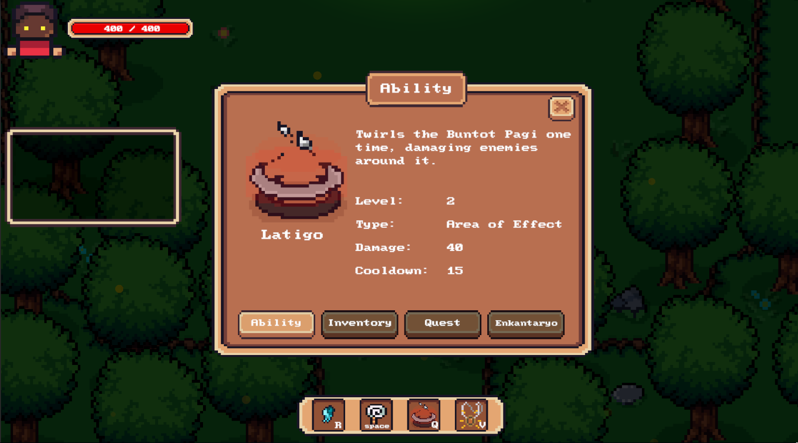
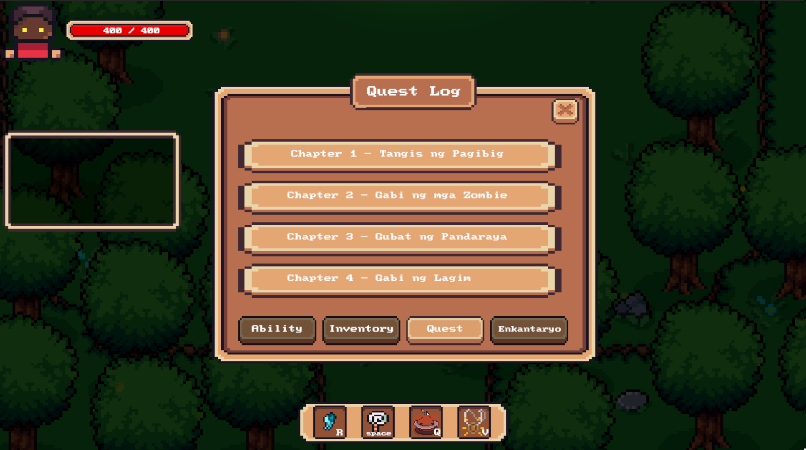

# Dayo

A 2D top-down action-adventure game built with **Unity** and **C#**, inspired by the folklore and supernatural creatures of Aklan, Philippines. Developed as a capstone project for the BS Information Technology program at STI College Kalibo.

**Play it here:** [pedro-parker.itch.io/dayo](https://pedro-parker.itch.io/dayo)



## About the Game

Dayo follows Pedro, a skeptical city boy who accidentally binds an ancient Anito Mask to his face. The mask lets him see the spirit world, and he must travel across five villages in the province to resolve the supernatural conflicts haunting each one. Every village has its own unique creatures drawn from local folklore, such as the White Lady, Amaranhig, Wakwak, and Mambabarang.

## Features

- **Chapter-based quests:** five story chapters, each set in a village with its own creatures and objectives, tracked by an on-screen quest tracker and a quest log
- **Action combat:** fight folklore creatures with health bars and use a hotbar of abilities with cooldowns
- **Ability system:** upgradeable abilities with level, damage, type (e.g., area of effect), and cooldown stats, such as the *Latigo* spin attack
- **Riddle encounters:** answer *bugtong* (Filipino riddles) by typing in the answer to progress through a chapter
- **Enkantaryo:** an in-game codex that records the origin, appearance, and background of each creature Pedro encounters
- **Dialogue system:** NPC conversations with a skip option
- **Player progression:** maximum health grows as the story advances
- **Inventory and menu system:** tabbed menu for Ability, Inventory, Quest, and Enkantaryo
- **Save/load system:** player progress is stored and restored using JSON
- **Original art:** characters, creatures, and UI created for the game

## Screenshots

| | | |
|---|---|---|
|  |  |  |
| Story dialogue | Combat in Chapter 2 | Bugtong-Bugtong riddle encounter |
|  |  |  |
| Chapter 4 quest | Enkantaryo codex | Creature entry (White Lady) |
|  |  |  |
| Chapter 5 quest | Ability menu | Quest log |

## Chapters

| Chapter | Title | Objective |
|---------|-------|-----------|
| 1 | Tangis ng Pagibig | Find hidden objects |
| 2 | Gabi ng mga Zombie | Defeat the Amaranhig |
| 3 | Gubat ng Pandaraya | Answer the riddles correctly |
| 4 | Gabi ng Lagim | Defeat the Wakwak |
| 5 | Sumpa ng Mambabarang | Defeat the Mambabarang |


## How to Run

**Option 1: Play the build**
Download and play the game on [itch.io](https://pedro-parker.itch.io/dayo).

**Option 2: Open in Unity**
1. Install Unity [editor version] through Unity Hub.
2. Clone this repository:
   ```
   git clone https://github.com/kukoo21/Dayo.git
   ```
3. In Unity Hub, click **Add** and select the cloned project folder.
4. Open the project and load the scene [scene name, e.g., MainMenu].
5. Press **Play**.

## Controls

| Action | Key |
|--------|-----|
| Move | WASD |
| Skip dialogue | E |
| Normal Attacl | Spacebar |
| Latigo (Special area attack) | Q |
| Other abilities | R (Diwata), V (Anting-anting) |

## My Role

**Programmer and Game Artist**
- Implemented gameplay systems, UI, and game logic in C#
- Built the JSON save/load system and supporting systems (inventory, quests, level progression)
- Created the game's art assets
- Debugged and tested throughout development

**Developers**
- John Michael Magdael (Programmer/Game Artist)
- Kevin Novilla (Level Designer)
- Abegail Tulio (Narrative Designer)
## Author

**John Michael G. Magdael**
BS Information Technology
STI College Kalibo (2026)
Email: jmmagdael4k@gmail.com
GitHub: [kukoo21](https://github.com/kukoo21)
itch.io: [Pedro_Parker](https://pedro-parker.itch.io)
